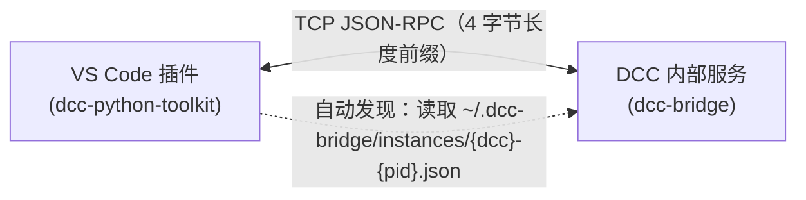

# DCC Python / DCC Bridge

Monorepo for DCC Python development tools.

本仓库包含两个包：

- [`packages/dcc-bridge`](packages/dcc-bridge) — Python 核心包，提供 DCC 端 TCP 服务、通用 TCP 客户端、`dcc` CLI、DCC 适配器、代码执行、模块热重载与调试集成。
- [`packages/vscode-extension`](packages/vscode-extension) — VS Code 插件，提供编辑器命令、状态面板和调试适配器入口。

## 快速开始

### AI / CLI 使用

```bash
pip install dcc-bridge

# 配置 DCC 自启动（以 Maya / 3ds Max 为例）
dcc setup maya --version 2024
dcc setup 3dsmax

# 打开 DCC 后，查看运行中的实例并执行代码或文件
dcc status
dcc run code "print('hello')"
dcc run file /path/to/script.py
```

### VS Code 插件使用

1. 安装 `dcc-bridge` Python 包（见上）。
2. 在 VS Code 中加载 `packages/vscode-extension`。
3. 使用 `DCC Python ToolKit: Open Dashboard` 查看运行中的 DCC 实例并选择目标。
4. 按 `Ctrl + Enter` 执行代码，`Ctrl + Shift + P` 搜索 `DCC Python ToolKit` 查看更多命令。

## 已测试的 DCC

- Maya（2020+）
- 3ds Max（2021+）
- Substance Painter
- Substance Designer

## 架构

```
vscode-maya-python/
├── packages/
│   ├── dcc-bridge/          # Python 核心包（可独立发布到 PyPI）
│   └── vscode-extension/    # VS Code 插件
├── media/                   # 演示素材
└── test/                    # 遗留的 DCC 测试脚本
```




```
核心设计：

- `dcc-bridge` 不依赖 VS Code，DCC 端服务与 CLI 共用同一套协议与适配器。
- VS Code 插件通过 TCP 直连 DCC，不再作为 CLI 中转。
- DCC 服务启动后自动写入发现文件，CLI 与插件可零配置发现运行中的实例；读取时惰性检查 PID 并清理已退出进程。
- TCP 端口从 `7002` 开始自动递增，避免同时运行多个 DCC 实例时冲突。
- 通信协议：TCP JSON-RPC，带 4 字节长度前缀。

## 许可证

本项目采用 [PolyForm Noncommercial License 1.0.0](LICENSE) 授权，仅供非商业用途使用。详见根目录 `LICENSE` 文件。
