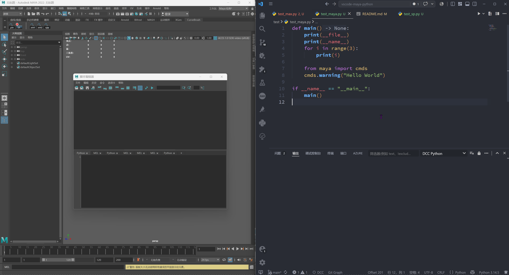
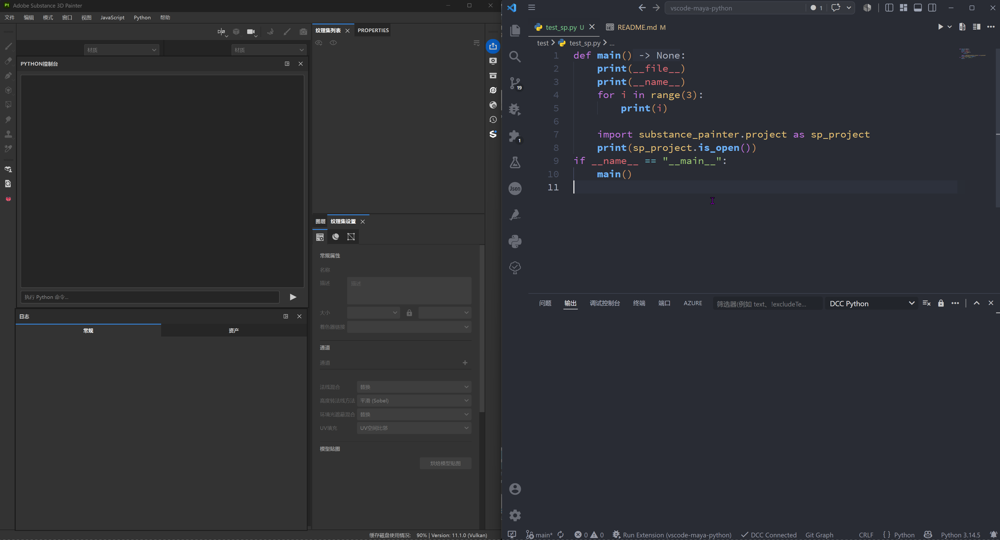
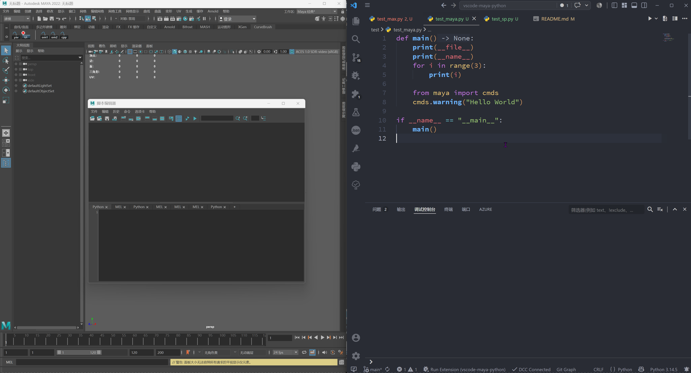
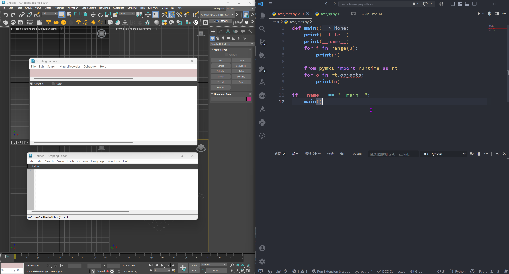
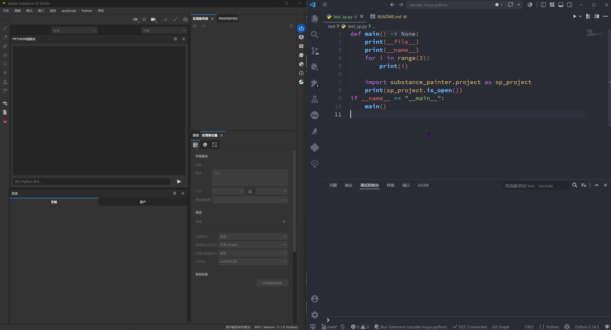

# DCC Python (Visual Studio Code)

A universal Python development tool designed to support **all DCC applications** with Python scripting capabilities.

一个通用的 Python 开发工具，旨在支持**所有具备 Python 脚本能力的 DCC 软件**。

本项目开发参考了开源仓库 [vscode-maya-python](https://codeberg.org/nils-soderman/vscode-maya-python)，在此由衷感谢作者 [@nils-soderman](https://nilssoderman.com/) 的开源分享与贡献。

This project refers to the open-source repository [vscode-maya-python](https://codeberg.org/nils-soderman/vscode-maya-python). Special thanks to [@nils-soderman](https://nilssoderman.com/) for his open-source work and contributions.

**Currently tested with / 目前经过测试的 DCC：**
- Maya
- 3ds Max
- Substance Painter

**Other DCC applications will be supported gradually / 其他 DCC 将逐步支持。**

> **Requirement / 要求:** All features require Python 3.7+ in the DCC environment. The codebase uses modern Python 3 syntax (f-strings, type annotations, etc.) and debugpy requires Python 3.7+. DCC applications running Python below this version will encounter errors.
>
> **所有功能需要 DCC 环境中 Python 版本 ≥ 3.7**。代码库使用现代 Python 3 语法（f-string、类型注解等），且 debugpy 需要 Python 3.7+。运行低于此版本 Python 的 DCC 软件将报错。

---

## Features / 功能

### Execute Code / 执行代码

Run code in your DCC directly from within the editor:

在 VS Code 中直接执行代码并发送到 DCC 软件：

**Maya:**

**3ds Max:**

**Substance Painter:**

**Command / 命令:** `DCC Python: Execute`
**Keyboard Shortcut / 快捷键:** <kbd>Ctrl</kbd> + <kbd>Enter</kbd>

The selected text will be executed. If nothing is selected, the entire document will be executed.

执行选中的代码片段；若未选中任何内容，则执行整个文档。

---

### Attach Debugger / 附加调试器

Attach VS Code to your DCC to debug scripts, set breakpoints and step through code.

将 VS Code 附加到 DCC 软件，支持设置断点、单步调试代码。

**Maya:**

**3ds Max:**

**Substance Painter:**

**Command / 命令:** `DCC Python: Attach Debugger`

When the debugger is attached, press <kbd>Ctrl</kbd> + <kbd>Enter</kbd> to execute code — breakpoints will be hit automatically. `print()` output is redirected to the VS Code Debug Console.

调试器附加后，按 <kbd>Ctrl</kbd> + <kbd>Enter</kbd> 执行代码将自动触发断点。`print()` 输出会重定向到 VS Code 的调试控制台。

---

### Reload Modules / 重载模块

Reload Python modules from your workspace without restarting the DCC application. Useful for iterative development.

无需重启 DCC 软件即可重载工作区中的 Python 模块，方便迭代开发。

**Command / 命令:** `DCC Python: Reload Modules`

---

### Execute Entry Point / 执行入口点

Execute a predefined entry point script with a single command. Useful for running a project's `main.py` or a scene setup script.

一键执行预定义的入口点脚本，适用于运行项目的 `main.py` 或场景初始化脚本。

**Command / 命令:** `DCC Python: Execute Entry Point`

**Configuration / 配置项:**

| Setting / 配置项 | Description / 说明 | Default / 默认值 |
|---|---|---|
| `dcc-python.execute.entryPoint` | Entry point script path (absolute or relative to workspace) / 入口脚本路径（绝对路径或相对路径） | `""` |
| `dcc-python.execute.entryPointReload` | Reload workspace modules before executing / 执行前重载工作区模块 | `true` |

---

## Getting Started / 快速开始

### 1. Install the Extension / 安装扩展

Install the "DCC Python" extension from the VS Code Marketplace.

从 VS Code 应用商店安装 "DCC Python" 扩展。

### 2. Start the Server in Your DCC / 在 DCC 中启动服务端

Press <kbd>Ctrl</kbd> + <kbd>Enter</kbd> in VS Code — an error prompt will appear in the bottom-right corner. Click the "Copy" button, then paste and run the code in your DCC's script editor.

在 VS Code 中按 <kbd>Ctrl</kbd> + <kbd>Enter</kbd>，右下角会弹出提示框，点击"Copy"按钮，然后粘贴到 DCC 的脚本编辑器中运行即可。

### 3. Execute Code / 执行代码

Open a Python file in VS Code, press <kbd>Ctrl</kbd> + <kbd>Enter</kbd> to send the code to your DCC.

在 VS Code 中打开 Python 文件，按 <kbd>Ctrl</kbd> + <kbd>Enter</kbd> 将代码发送到 DCC 执行。

---

## Configuration / 配置

All settings can be found in VS Code Settings under "DCC Python".

所有配置项可在 VS Code 设置中搜索 "DCC Python" 找到。

### Server / 服务端

| Setting / 配置项 | Description / 说明 | Default / 默认值 |
|---|---|---|
| `dcc-python.server.host` | DCC server host address / DCC 服务端主机地址 | `127.0.0.1` |
| `dcc-python.server.port` | DCC server port / DCC 服务端端口 | `7002` |

### Execute / 执行

| Setting / 配置项 | Description / 说明 | Default / 默认值 |
|---|---|---|
| `dcc-python.execute.showOutput` | Show output panel when executing / 执行时显示输出面板 | `true` |
| `dcc-python.execute.clearOutput` | Clear output on each execution / 每次执行时清空输出 | `true` |
| `dcc-python.execute.name` | Value of `__name__` when executing / 执行时 `__name__` 的值 | `__main__` |
| `dcc-python.execute.entryPoint` | Entry point script path / 入口脚本路径 | `""` |
| `dcc-python.execute.entryPointReload` | Reload modules before entry point / 执行入口点前重载模块 | `true` |

### Debugger / 调试器

| Setting / 配置项 | Description / 说明 | Default / 默认值 |
|---|---|---|
| `dcc-python.debug.port` | Debugger connection port / 调试器连接端口 | `7012` |
| `dcc-python.debug.justMyCode` | Debug only user-written code / 仅调试用户代码 | `true` |

### Environment / 环境

| Setting / 配置项 | Description / 说明 | Default / 默认值 |
|---|---|---|
| `dcc-python.environment.addWorkspaceToPath` | Add workspace path to Python `sys.path` / 将工作区路径添加到 Python `sys.path` | `true` |

---

## Supported DCC Applications / 支持的 DCC 软件

| DCC | Support Status / 支持状态 |
|---|---|
| Maya | ✅ Tested / 已测试 |
| 3ds Max | ✅ Tested / 已测试 |
| Substance Painter | ✅ Tested / 已测试 |
| Other DCC with Python | 🔄 Coming soon / 即将支持 |

> **Python Requirement / Python 版本要求:** All features require Python 3.7+ in the DCC environment. The codebase uses modern Python 3 syntax (f-strings, type annotations, etc.) and debugpy requires Python 3.7+. DCC applications running Python below this version will encounter errors.
>
> **所有功能需要 DCC 环境中 Python 版本 ≥ 3.7**。代码库使用现代 Python 3 语法（f-string、类型注解等），且 debugpy 需要 Python 3.7+。运行低于此版本 Python 的 DCC 软件将报错。

---

## Commands / 命令

All commands can be accessed via the Command Palette (<kbd>Ctrl</kbd> + <kbd>Shift</kbd> + <kbd>P</kbd>).

所有命令可通过命令面板（<kbd>Ctrl</kbd> + <kbd>Shift</kbd> + <kbd>P</kbd>）访问。

| Command / 命令 | Description / 说明 | Shortcut / 快捷键 |
|---|---|---|
| `DCC Python: Execute` | Execute selected code or entire file / 执行选中代码或整个文件 | <kbd>Ctrl</kbd> + <kbd>Enter</kbd> |
| `DCC Python: Execute Entry Point` | Execute the predefined entry point script / 执行预定义入口脚本 | — |
| `DCC Python: Reload Modules` | Reload workspace Python modules / 重载工作区 Python 模块 | — |
| `DCC Python: Attach Debugger` | Attach VS Code debugger to DCC / 附加 VS Code 调试器到 DCC | — |

---

## Contact / 联系方式

If you have any questions, suggestions, or encounter issues, please feel free to [open an issue](https://github.com/JBQ-0831/DCC-Python/issues).

如有任何问题、建议或遇到 Bug，请[提交 Issue](https://github.com/JBQ-0831/DCC-Python/issues)。
